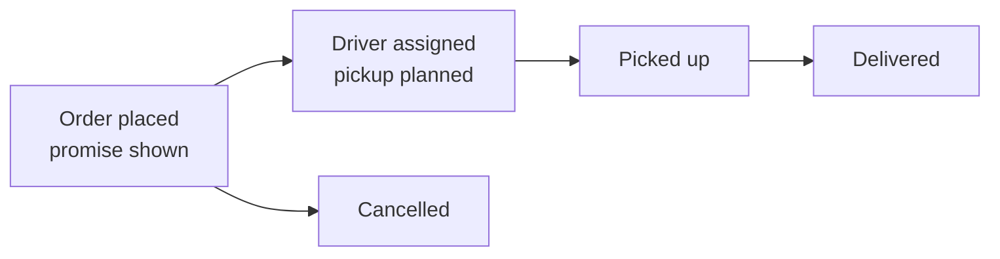
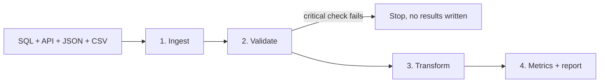

# FlashEats Late Delivery Pipeline

FDE Assignment 2 (Classes 4-8) - Track A: FlashEats

## Problem and answer

FlashEats says late deliveries are going up and customers don't trust the ETA shown in the app. They
want to know what is going on before they pay for an AI model that predicts delays. The data is spread
across a SQL database, a dispatch API, a JSON file from the driver app and a few CSV files, and none of
it is organised around the order.

This project pulls the data together, checks it, builds one table with a row per order, and calculates
metrics for the late delivery KPI.

**Answer: don't build the AI delay predictor yet.** 56.5% of orders are late, and 98.9% of the late
minutes happen *before pickup*, not on the road. Orders picked up more than 10 minutes late already end
up late 96.9% of the time - a simple rule finds them.

## Stakeholders

| Who | Why they care |
|---|---|
| VP Operations | Owns the late delivery problem and decides whether to fund the AI model |
| Operations / dispatch | Run the interventions (reassigning drivers, priority dispatch, calling restaurants) |
| Support Lead | Deals with the complaints |
| Finance | Pays for credits and refunds |
| Engineering | Owns the systems that would need new tracking |

## KPI

**Late Delivery Rate** = delivered orders that arrive after the promised ETA / delivered orders.
Goal: reduce it.

"Promised ETA" means the ETA the customer saw at checkout (`orders.promised_eta`). The dispatch system
keeps moving its ETA later after the order is placed - against that moving ETA the late rate would be
26.2% instead of 56.5%, which doesn't match what the customer experienced.

## Data sources and retrieval

| Source | Where | How it's read | One row = | Used for | Problem found |
|---|---|---|---|---|---|
| Order platform | `database/flasheats.db` | SQL | order (1,603 rows) | promise, pickup, delivery, status | 3 orders twice; 37 with no delivery time; only the first driver |
| Dispatch service | `api/` (mock API) | REST API, paginated | order (1,600) | current driver, planned pickup, updated ETA | ETA gets moved later after checkout |
| Driver app | `data/driver_events.json` | nested JSON | event (10,035) | backup delivery time | no "arrived at restaurant" event |
| Support desk | `data/support_tickets.csv` | CSV | ticket (202) | customer complaints | some tickets have no order; spelling variants |
| App analytics | `data/customer_app_actions.csv` | CSV | app action (2,365) | support opened in the app | - |
| Ops tools | `data/order_interventions.csv` | CSV | intervention (430) | what ops did and when | 45 logged after delivery |
| Restaurant app | `data/restaurant_status.csv` | CSV | latest status (502) | not used | only 31% of orders, no history |

**Not used as inputs:** `order_outcomes.csv` already has a late flag worked out by someone else, so it is
only used to cross-check the pipeline (the numbers match). The class pack also has `order_events.csv`,
`customer_interactions.csv` and `restaurants.csv`; they are partial copies of the sources above (or the
same as the SQL table), so they are left out of this repo.

**Checking nothing is missing:** the API returns 16 pages with 1,600 records - the same as the total it
reports and the number of unique order ids. The orders table and the API have the same orders, and all
row counts match the client's `manifest.json`. The API fails on purpose twice (HTTP 500 and 429); the
pipeline retries and saves every raw page in `output/raw/`.

Full source map (business questions -> sources, owners, gaps): [docs/source_map.md](docs/source_map.md).

## Data checks

13 checks, each marked PASS / WARN / FAIL / UNKNOWN with what was done about it - **PASS 4, WARN 7,
FAIL 1, UNKNOWN 1**. If a critical check fails (e.g. the API didn't return every record), the pipeline
stops without writing results. The most important ones:

| Check | Result | What was found | What was done |
|---|---|---|---|
| Which ETA counts as the promise? | WARN | Dispatch moved the ETA later on 91.4% of orders. Late rate: 56.5% against the original promise, 26.2% against the updated ETA | Used the original promise (what the customer saw) |
| Delivered orders have a delivery time | WARN | 37 delivered orders have no delivery time; the driver app matches the orders table to the second on all 1,495 orders both have | Used the driver app time for those orders |
| One row per order | WARN | 3 orders appear twice; the copies only differ on traffic level | Kept the first copy |
| Timestamps are in the right order | WARN | 4 promises are before the order was placed; 5 deliveries are before pickup | Left out of the KPI / out of the delay split |
| orders.driver_id is the driver who delivered | WARN | It is always the first driver; 95 orders were reassigned | Took the driver from the dispatch API |
| Distance column is usable | FAIL | 50.4% of orders are exactly 18.0 km - a cap, not a real distance | Did not use distance |
| Restaurant delay vs driver delay? | UNKNOWN | No "arrived at restaurant" event, and restaurant status only covers a third of orders | Reported the pickup delay as one number |

All 13 checks: [output/report.md](output/report.md#data-checks) and [output/checks.csv](output/checks.csv).

## Workflow and data model



The dispatch API has a planned pickup time, so every order's delay splits into **pickup slip** (picked
up late) plus **transit overrun** (slow drive). All sources are joined into one table with one row per
order (`output/order_table.csv`): times, late or not, the delay split, support contacts and interventions.
Tables with many rows per order are counted per order before joining, so orders don't get duplicated, and
each order records why it was left out of the KPI (if it was).

Diagrams and details: [docs/data_model.md](docs/data_model.md).

## Metrics

| ID | Metric | Type | Value | What it means for the KPI |
|---|---|---|---|---|
| M1 | Late Delivery Rate | Outcome (the KPI) | **56.5%** (863/1,528) | Is the KPI |
| M2 | Pickup Slip Rate | Workflow (where delay starts) | **42.1%** (641/1,523) | 98.9% of late minutes happen before pickup |
| M3 | ETA Drift | Promise reliability | **+8.1 min** median | Against the updated ETA the late rate would be 26.2% |
| M4 | Late-Order Support Contact Rate | Customer reaction | **29.9%** (258/863) | On-time orders: 5.1% |
| M5 | At-Risk Intervention Coverage | Intervention | **20.8%** (133/641) | At-risk orders end up late 96.9% of the time |

- **M1** late deliveries / delivered orders with a valid promise and a delivery time
- **M2** orders picked up more than 10 min after the planned pickup / orders where the delay could be split
- **M3** median of (updated ETA from dispatch - original promised ETA)
- **M4** late orders where the customer opened support in the app or raised a ticket / late orders
- **M5** at-risk orders (from M2) that got an intervention before pickup / at-risk orders

Late rate under different definitions of "late": any lateness (VP Operations) **56.5%**; more than 10
minutes (Support Lead) **23.2%**; against the updated ETA **26.2%** (not the KPI). Nobody officially
owns the KPI.

Main findings:

- Late orders are picked up a median 13.9 min after the planned pickup, then the drive is 5.9 min
  *faster* than planned.
- Orders picked up more than 10 min late end up late 96.9%; everything else 27.2%.
- At-risk orders are late 97.0% with an intervention before pickup and 96.9% without - no sign today's
  interventions help (they go to orders already in trouble, so this isn't proof either way).

Full report: **[output/report.md](output/report.md)** - metrics in [output/metrics.csv](output/metrics.csv), one row per order in [output/order_table.csv](output/order_table.csv).

## How the pipeline works



1. **Ingest** - reads the database, pages through the dispatch API (retrying on HTTP 500 / 429, up to 3
   times), flattens the driver app JSON and reads the CSVs. Raw API responses are saved in `output/raw/`.
2. **Validate** - the 13 checks above. A critical failure stops the run with a clear message.
3. **Transform** - builds the order table.
4. **Metrics + report** - writes the 5 metrics and `output/report.md`.

Running it again overwrites `output/` with the same results. Each run is logged to `output/pipeline.log`.

## How to run

Python 3.11 or newer.

```bash
pip install -r requirements.txt
python pipeline.py
```

It starts the mock dispatch API itself if it isn't already running.

It writes `output/`: `report.md`, `metrics.csv`, `checks.csv`, `order_table.csv`, `results.json`,
`raw/` (raw API pages) and `pipeline.log`. The `output/` in this repo is from a full run, so the results
can be checked without running anything.

## Facts, assumptions, unknowns and limitations

| | |
|---|---|
| **Facts** | 56.5% of orders are late (863 of 1,528). 98.9% of late minutes happen before pickup. Orders picked up more than 10 min late are late 96.9% of the time vs 27.2% otherwise. Late orders contact support 29.9% of the time vs 5.1%. |
| **Assumptions** | The promise is `orders.promised_eta`. All timestamps are in the same timezone (none is stored). The driver app delivery time can be used when the orders table has none (they matched on every order both had). The first copy of a duplicated order is the right one. |
| **Unknowns** | Whether the pickup delay is the restaurant (food not ready) or the driver (arrived late). Whether interventions actually help (there is no control group). Who owns the KPI. |
| **Limitations** | One month (August 2026) in one city. Distance can't be used. 72 orders are not in the KPI (68 not delivered, 4 with a promise before the order time). Everything is association, not cause and effect. |

## Recommendation (the decision this supports)

- **Don't build the AI delay predictor yet** - a simple rule (picked up more than 10 min late) already
  finds orders that end up late 96.9% of the time.
- **Start recording** when the driver arrives at the restaurant and when the food is ready, to tell
  restaurant delay from driver delay.
- **Act on at-risk orders earlier** - only 20.8% get an intervention before pickup today. Test one
  intervention against a control group, agree who owns the KPI, then re-run this pipeline and compare.

## Class challenge solutions

Solved versions of the FlashEats class notebooks are in [Challenge_Solutions/](Challenge_Solutions/). Each keeps
the original prompts, fills in every TODO, and has a written answer after each challenge:

| Notebook | Covers |
|---|---|
| [Class 5 Starter](Challenge_Solutions/FlashEats_Class5_Starter_Solved.ipynb) | size the late problem (SQL), test "traffic is the problem", support tickets, reliable API retrieval, driver events |
| [Class 5 Student](Challenge_Solutions/FlashEats_Class5_Student_Solved.ipynb) | the same investigation, plus the source map and the final recommendation |
| [Class 6 Student](Challenge_Solutions/FlashEats_Class6_Student_Solved.ipynb) | validation contract, "late" under each stakeholder's definition, categories, mapping, freshness, the PASS / WARN / FAIL gate |
| [Class 7 Challenge](Challenge_Solutions/FlashEats_Class7_Challenge_Solved.ipynb) | order timelines, the order-centred model, interaction -> intervention -> outcome, metrics, workflow questions |

They run from inside `Challenge_Solutions/` using this repo's `database/`, `data/` and `api/` folders. To re-run
them: `pip install -r requirements.txt matplotlib notebook`.

## Project files

```
pipeline.py        the whole pipeline
requirements.txt
api/               mock dispatch API + its data
database/          flasheats.db (SQL)
data/              CSV and JSON files from the client
docs/              source map, workflow and data model diagrams
Challenge_Solutions/  solved class notebooks (Classes 5-7)
output/            results of the last run (report, metrics, checks, raw API pages, log)
```

Data: the SST FlashEats classroom pack
([manangupta12/flasheats-classroom-pack](https://github.com/manangupta12/flasheats-classroom-pack)).
