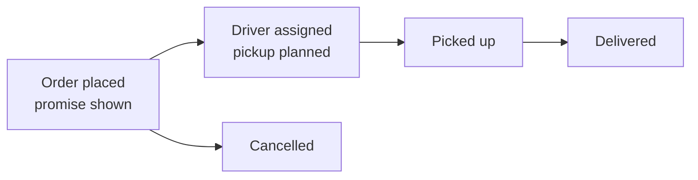
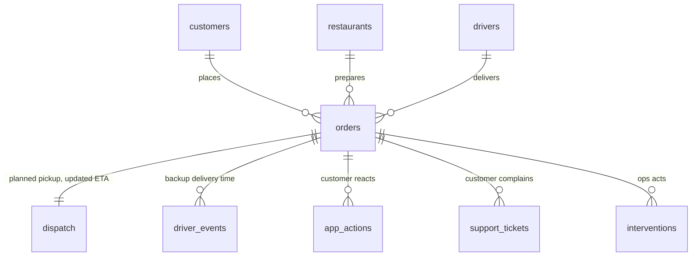

# Workflow and data model

## Order workflow

While an order is in progress:

- the **customer** may open support in the app or raise a ticket
- **ops** may intervene - reassign the driver, prioritise dispatch, contact the restaurant, or give a credit

The dispatch API has a **planned pickup time**, so every order's delay splits into two parts:

- **pickup slip** = actual pickup - planned pickup
- **transit overrun** = actual drive time - planned drive time

For late orders, 98.9% of the late minutes are pickup slip.

## Data model

The sources are organised by system. The pipeline joins them into **one table with one row per order**
(`output/order_table.csv`), because the KPI is about orders.

Tables with many rows per order (app actions, tickets, interventions, driver events) are counted per
order first and then joined, so the join can't create duplicate orders.

Main columns of `order_table.csv`: order and driver ids, the lifecycle times (created, planned pickup,
pickup, promised ETA, updated ETA, delivered), `in_kpi` and `excluded_because`, `delay_min` and `late`,
`pickup_slip_min` and `transit_overrun_min`, `contacted_support`, and `intervention_before_pickup`.

## Limitation

There's no event for the driver arriving at the restaurant, so the delay before pickup can't be split
into restaurant delay vs driver delay.
