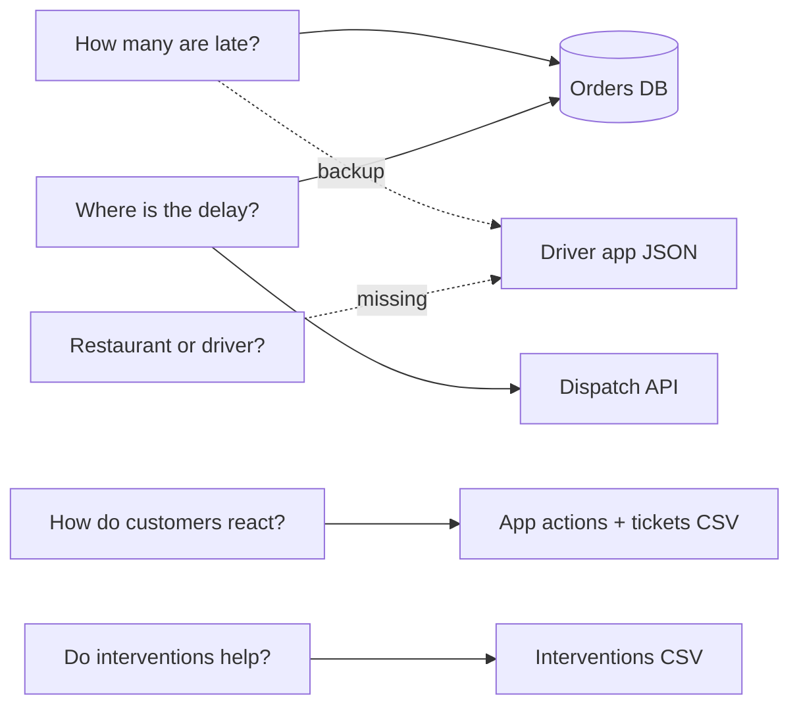

# Source map

## Business questions -> information -> source

| Business question | Information needed | Source |
|---|---|---|
| How many orders are late? | promised ETA, delivery time, order status | orders table (SQL), driver app as backup |
| Where does the delay happen? | planned pickup, actual pickup | dispatch API + orders table |
| Is it the restaurant or the driver? | when the food was ready, when the driver arrived | **not available** (see gaps) |
| How do customers react? | support opened in the app, support tickets | app actions CSV, support tickets CSV |
| Do interventions help? | intervention type and time | interventions CSV |

## Sources

| Source | Owner | Retrieval | One row = | Rows | Problems found |
|---|---|---|---|---|---|
| `orders` (SQL) | Order platform | SQL | order | 1,603 | 3 orders appear twice, 37 delivered orders with no delivery time, 4 promises before the order time, 5 deliveries before pickup, `driver_id` is the first driver only, distance capped at 18 km |
| `customers`, `drivers`, `restaurants` (SQL) | Order platform | SQL | customer / driver / restaurant | 900 / 120 / 60 | - |
| Dispatch API | Dispatch | REST API, paginated (fails on purpose on pages 3 and 5) | order | 1,600 | ETA gets moved later after checkout |
| `driver_events.json` | Driver app | nested JSON | driver event | 10,035 | no "arrived at restaurant" event |
| `support_tickets.csv` | Support | CSV | ticket | 202 | 1 duplicate ticket, 3 with no order, spelling variants |
| `customer_app_actions.csv` | App / product | CSV | app action | 2,365 | - |
| `order_interventions.csv` | Operations | CSV | intervention | 430 | 1 before the order existed, 45 after delivery |
| `restaurant_status.csv` | Restaurants | CSV | latest status per order | 502 | **not used** - only covers 31% of orders, no history |

Not used as inputs: `order_outcomes.csv` already has a late flag calculated by someone else, so it is
only used to cross-check the pipeline's numbers (they match). The class pack also has `order_events.csv`,
`customer_interactions.csv` and `restaurants.csv`; they are partial copies of the sources above (or the
same as the SQL table), so they are left out of this repo. `manifest.json` (the client's row counts) is used to check nothing is missing.

## Main gaps

1. No record of when the driver arrives at the restaurant, so restaurant delay can't be told apart from
   driver delay.
2. Nobody owns the late delivery KPI, and stakeholders define "late" differently.
3. Distance is capped at 18 km for half the orders, so it can't be used.
